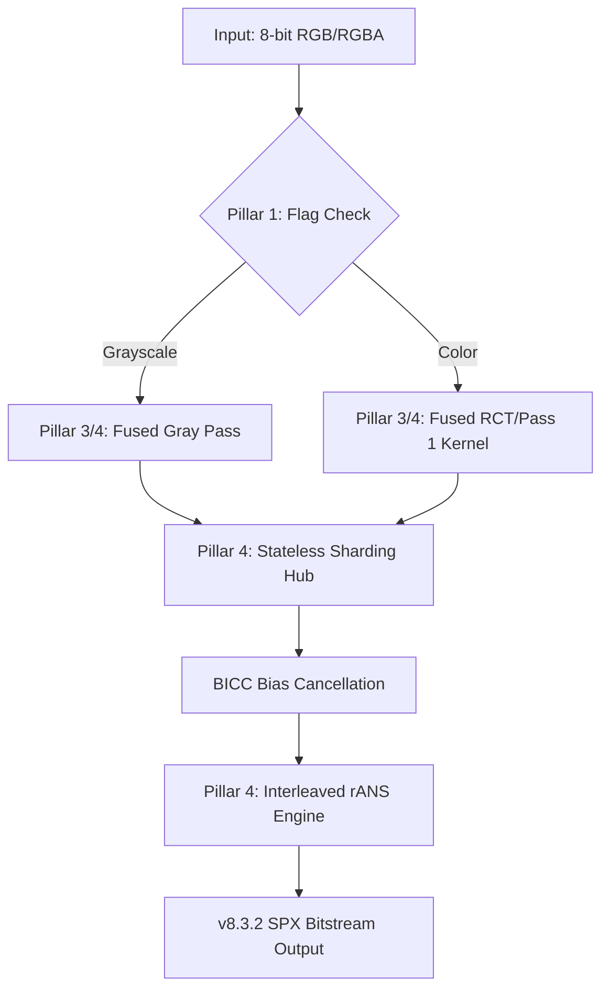

# SPX: Context-Sensitive Data Engine

     

An implementation of lossless image compression using **Entropy Sharding** and **4-way Interleaved rANS**. This project serves as a technical demonstration of achieving competitive compression performance through contextual sharding and statistical modeling rather than high-complexity spatial prediction systems.


*Visualizing the G-sub Pipeline: Source -> Green Foundation (Grn) -> Modular G-sub Residuals (RD/BD)*

---

### v8.3.2 Performance Snapshot

The following data characterizes the throughput and compression efficiency across standard datasets (Baseline v7.5.0).

| Dataset | Type | SPX BPP | **Savings (vs PNG)** | **SPX Enc Speed** | WebP (M6) Speed | JXL (E7) Speed |
| :--- | :--- | :--- | :--- | :--- | :--- | :--- |
| **Kodak** | RGB | **9.79** | **-24.64 %** | **32.69 MB/s** | 0.32 MB/s | 5.40 MB/s |
| **CLIC '25** | RGB | **8.06** | **-28.33 %** | **45.27 MB/s** | 1.15 MB/s | 5.27 MB/s |
| **CLIC '21** | RGB | **8.46** | **-28.03 %** | **50.38 MB/s** | 0.97 MB/s | 5.62 MB/s |
| **DIV2K Val**| 2K | **9.22** | **-27.32 %** | **49.02 MB/s** | 1.28 MB/s | 5.83 MB/s |
| **DIV2K Train**| 2K | **9.35** | **-26.22 %** | **45.62 MB/s** | 1.38 MB/s | 6.15 MB/s |
| **Tecnick** | RGB | **5.18** | **-25.90 %** | **23.34 MB/s** | 0.66 MB/s | 4.56 MB/s |
| **Tecnick** | Gray | **1.68** | **-27.63 %** | **12.41 MB/s** | 0.27 MB/s | 5.05 MB/s |
| **Waterloo** | RGB | **10.51** | **n/a** | **98.94 MB/s** | 2.17 MB/s | 10.79 MB/s |
| **Waterloo** | Gray | **3.44** | **n/a** | **33.66 MB/s** | 0.53 MB/s | 11.82 MB/s |

> [!NOTE]
> **Hardware Benchmark Environment**:
> - **CPU**: AMD Ryzen 5 3500X (6-Core, 3.60 GHz)
> - **RAM**: 32.0 GB
> - **OS**: Windows 11 (64-bit, x64)

#### **Technical Comparison**
- **Encoding Speed**: SPX is consistently **25x–150x faster** than WebP (Method 6) and **5x–7x faster** than JPEG-XL (Effort 7).
- **Quality Assurance**: Bit-perfect reconstruction across all 1,500+ test images (**MSE = 0.00000000**).
- **Core Efficiency**: High instruction-level parallelism (ILP) via 4-way interleaved rANS.

*Full comparative analysis vs. standard formats is available in [Official Benchmarks](./technical/BENCHMARK.md).*

---

### v8.3.2 Technical Analysis (4-Pillar Architecture)
- **Core Workflow**: Optimized pipeline featuring **Foundational Protocol** $\rightarrow$ **Prediction Kernels** $\rightarrow$ **Spatial Transforms** $\rightarrow$ **Stateless Sharding**.
- **Predictor Hub (Pillar 2)**: Decoupled hub in `predictor.py` featuring **Branchless Edge-Tuned MED** for maximum JIT pipelining.
- **Context-Aware Path Architecture**: 
    - **RGB Path (Pillar 3/4)**: G-sub RCT transform coupled with a stateless sharding matrix optimized for cross-channel residuals.
    - **Grayscale Fast-Path**: Hardware-accelerated monochrome bypass utilizing serialized Green-channel isolation.
- **Stateless Sharding Hub (Pillar 4)**: Unified profile-driven context ID derivation using the `ShardProfile` configuration-as-data model.
- **BICC (Bias Cancellation)**: Intelligent PDF centering applied to residuals to minimize dispersion.
- **Bitplane rANS**: Hierarchical entropy modeling using a **2,688-way context model** (42 Shards x 64 Spatial Patterns).
- **4-Way Interleaved rANS Core**: Vectorized entropy engine achieving optimized instruction-level parallelism (ILP).

---

## 2. Comparison with Existing Formats

- **Compression**: **~25-30% smaller** than standard PNG; competitive with WebP (m6) on high-resolution photography.
- **Efficiency**: Stateless sharding provides a balanced profile for both high-frequency noise and low-entropy gradients.
- **Decoding**: Throughput (~55–100 MB/s) on a single thread; scalable up to 250+ MB/s via multi-core batching.

---

## 3. System Requirements & Installation

- **Python Version**: 3.10+ (3.11+ recommended)
- **Python Packages**:
  - `numpy>=1.22.0`, `numba>=0.57.0`, `zstandard>=0.19.0`, `Pillow>=9.0.0`, `pytest>=7.0.0`
- **System Core (Linux)**:
  - Requires `zlib` and `libpng` headers for **Pillow** and **Zstd** I/O (`sudo apt install build-essential zlib1g-dev libpng-dev`).
- **Windows**: Self-contained.

> [!WARNING]
> **JIT Latency**: Initial execution involves a ~30s JIT compilation delay (Numba). Subsequent runs are near-instant.
> **Pro Tip**: Set the environment variable `NUMBA_CACHE_DIR` to a local directory to persist compiled kernels across sessions.

**Installation**:
```bash
pip install numpy>=1.22.0 numba>=0.57.0 zstandard>=0.19.0 Pillow>=9.0.0 pytest>=7.0.0
```

---

## 4. Quick Start

### 4.1 CLI Usage (Recommended)
```bash
# Compress
python main.py compress input.png --optimize

# Decompress
python main.py decompress input.spx --output restored.png

# Benchmark (Parallel)
python main.py benchmark ./path/to/images -n 20 -w 8
```

### 4.2 API Usage
```python
from core import compress_spx, decompress_spx

# 1. Compress Image (RGB/RGBA)
result = compress_spx("input.png", "output.spx", use_bitplane=False)
print(f"Ratio: {result.ratio:.2%} | Time: {result.enc_time:.2f}s")

# 2. Decompress Image
with open("output.spx", "rb") as f: payload = f.read()
rgb_arr, dec_time = decompress_spx(payload, "reconstructed.png")
print(f"Dec Time: {dec_time:.2f}s")
```

### 4.3 Windows Batch Utility (`test.bat`)
For Windows users, a convenient batch wrapper is provided for benchmarking:
```powershell
# Run benchmark on a custom folder
.\test bench C:\images\my_dataset

# Run solo SPX test on a relative path
.\test spx ./data/local_test

# Pass additional arguments (e.g., limit to 10 images)
.\test bench ./my_images -n 10
```
> [!NOTE]
> The utility supports both raw absolute/relative paths and pre-defined aliases (like `gold`, `clic`, `kodak`) if the corresponding data is present in your local `./data` directory.

### 4.4 Project Structure
```text
.
├── core/                   # SPX 4-Pillar Core Engine (Python/Numba)
│   ├── codec.py            # Bitstream orchestration & serialization
│   ├── sharding.py         # Pillar 4: Shard profiles & Stateless Hub
│   ├── rans.py             # Pillar 4: 4-way interleaved rANS core
│   ├── predictor.py        # Pillar 2: Branchless MED kernels
│   ├── transform.py        # Pillar 3: G-sub RCT & Spatial ops
│   ├── common.py           # Pillar 1: Protocol constants & Flags
│   └── env.py              # Environment & Dependency validator
├── technical/              # Deep-dive algorithmic specifications
├── data/                   # Default directory for benchmark datasets
├── native/                 # [Experimental] Rust-accelerated backend
├── test.bat                # Windows benchmark utility
└── main.py                 # CLI entry point
```

---

## 5. Technical Architecture & Execution Flow

SPX follows a strictly defined **4-Pillar Architecture** to transform raw pixels into a bit-perfect compressed stream:

### 5.1 The 4 Pillars of SPX
1.  **Pillar 1: Foundational Protocol (`common.py`)**: Defines the unified bitstream schema, flags, and entropy coding thresholds.
2.  **Step 1: Fused RCT & Profiling (Pillars 3 & 4)**: A unified high-performance kernel that performs the Green-Subtract transform, spatial padding, and Shard Pass 1 profiling (histograms/offsets) in a single raster scan to maximize L2 cache residency.
3.  **Step 2: Predictor Hub (Pillar 2)**: Integrated into the fused pass, performing branchless spatial decorrelation via **Branchless Edge-Tuned MED**.
4.  **Step 3: Stateless Sharding (Pillar 4)**: A second, purely memory-bound "Gather" pass that packs residuals into contiguous rANS buffers using the offsets from Step 1.
5.  **Step 4: Interleaved rANS (Entropy Coding)**: Vectorized 4-way entropy engine for final bit-perfect compression.



### 5.2 Deep-Dive Technical Series

For detailed algorithmic specifications, refer to the following documentation in the `technical/` directory:

*   [**01. PREDICTOR.md**](./technical/1.%20PREDICTOR.md): Detailed logic of the Spatial Dispatcher and MED variations.
*   [**02. SHARD_TEMPLATE.md**](./technical/2.%20SHARD_TEMPLATE.md): Specification of the Universal-42 matrix and context derivation.
*   [**03. RANS_MODE.md**](./technical/3.%20RANS_MODE.md): Architecture of the 4-way Interleaved rANS core and probability modeling.
*   [**04. DATASET_FINGERPRINT.md**](./technical/4.%20DATASET_FINGERPRINT.md): Statistical performance profiling across industrial datasets.

### 5.3 Dual-Path Strategy
SPX implements a **Context-Aware Bypass** logic to handle different image types with optimal efficiency:

*   **RGB Route**: Utilizing the **G-sub RCT**, it extracts a Green foundation (Lead) followed by RD/BD residuals (Lag). It uses a staggered processing window to maintain context consistency across channels.
*   **Grayscale Route**: If R=G=B is detected, the engine activates a specialized monochrome bypass, pruning ~65% of computational overhead. This path is highly optimized for **Bitplane rANS**, which decomposes the 8-bit signal into hierarchical layers to maximize redundancy extraction.

### 5.4 Stateless Sharding & Profile-Driven Hub
The backbone of SPX is the **Stateless Sharding Hub**, mapping pixels into 42+ contexts based on V-Tier (gradient strength), Intensity, and Trend. This configuration-as-data model allows for seamless profile switching without kernel recompilation.

For entropy coding, the engine utilizes a **30-Mode Template Matrix**:
- **6 Base Centroids**: Data-driven probability shapes derived from 6,000+ real-world image shards.
- **5 Sigma Scales**: Each centroid is scaled from `0.5` to `1.5` to adapt to different noise levels.
- **Zero-Overhead**: These 30 empirical modes are hardcoded in the decoder, allowing optimal PDF matching without the "Header Tax" of custom frequency tables.

### 5.5 Bitplane rANS & Entropy Core
For high-density images, SPX employs **Shard-Conditioned Bitplane rANS**. Instead of treating the residual as a single 256-symbol alphabet, it decomposes the signal into 2-bit layers. Each layer uses a massive **2,688-way context model** ($42 \text{ Shards} \times 64 \text{ Spatial Patterns}$), allowing the rANS core to isolate structural predictable bits from stochastic noise bits.

The **Interleaved rANS** engine further optimizes throughput by managing 4 independent state variables in a single loop, saturating CPU execution ports via ILP.

### 5.6 Memory Profile & Scalability
SPX is designed for low-latency processing with a predictable memory footprint.
- **Peak RAM (1080p RGB)**: ~85 MB
- **Peak RAM (4K RGB)**: ~320 MB
- **Peak RAM (8K RGB)**: ~1.2 GB
*Note: Memory usage scales linearly with pixel count. Peak values include Numba-managed JIT workspaces and Python object overhead.*

### 5.7 Cache Residency & Hot-Path Efficiency
SPX is optimized for L1/L2 cache residency to avoid memory stalls:
- **L1 (Hot Path)**: rANS Models, ZigZag LUTs, Branchless Predictors.
- **L2 (Context Hub)**: Stateless Spatial LUT (256 KB), Shard Histograms.
- **L3 (Bulk Data)**: Image Channel Buffers and Bitstream Payloads.
*Full technical audit available in [technical/CACHE.md](./technical/CACHE.md).*

### 5.8 Extensibility: Custom Shard Profiles
Pillar 4 (Stateless Sharding) allows adding new segmentation strategies without logic changes:
1.  **Define Boundaries**: Create new `V_BOUND` and `INTENSITY_SEG` numpy arrays in `sharding.py`.
2.  **Map Shards**: Implement a `build_shard_map_custom()` function to assign Context IDs.
3.  **Precompute LUTs**: Call `precompute_luts()` to generate the O(1) dispatch tables.
4.  **Register Profile**: Instantiate a new `ShardProfile` and update the `PROFILE_RGB` alias.

### 5.9 Developer Setup & Debugging
- **Regression Testing**: Run `pytest` to verify bit-perfect parity and logic integrity.
- **Log Verbosity**: Set `SPX_LOG_LEVEL=DEBUG` for detailed pipeline tracing.
- **Diagnostic Dumps**: Use `SPX_DUMP_SHARDS=1` to audit raw residual distributions.
- **Thread Safety**: Core modules utilize `threading.local()` for scratch-buffer management; ensure `clear_spx_workspaces()` is called in long-running server workers.

---

## 6. Performance Benchmarking (v7.x Unified Hub)
 
 The current engine is benchmarked using the **SPX Unified Hub**, providing objective head-to-head comparisons against WebP (Method 6) and JPEG-XL (Effort 7).

### 6.1 Comprehensive Metrics
  Detailed performance data, including compression savings, throughput (MB/s), and competitive win rates, are maintained in [technical/BENCHMARK.md](./technical/BENCHMARK.md).

### 6.2 Benchmark Baseline Versions
To ensure reproducibility, the competitive baselines are locked to the following versions:
- **WebP (Method 6)**: `cwebp` v1.3.2 (libwebp v1.3.2).
- **JPEG-XL (Effort 7)**: `cjxl` v0.8.2 (libjxl v0.8.2).
- **AVIF**: `avifenc` v1.0.1 (aom v3.7.0).
- **PNG (Optimize)**: `zopflipng` v1.0.3.

### 6.3 Usage
```bash
# Use the main entry point
python main.py benchmark C:\datasets\my_images -n 50

# Windows Shortcut (Batch)
.\test bench ./local_folder -n 50
```

### 6.3 Technical Control Arguments
Common arguments supported by the benchmarking suite:

| Argument | Full Name | Description | Example |
| :--- | :--- | :--- | :--- |
| **-n** | `--num_tests` | Limits the number of processed files. | `-n 50` |
| **--offset** | `--offset` | Skips the first N images in the set. | `--offset 100` |
| **-w** | `--workers` | Manually sets the number of CPU cores. | `-w 8` |
| **--codec** | `--codec` | Selects codec: `spx`, `webp`, `jxl`, `bench`. | `--codec bench` |
| **--reclassify**| `--reclassify`| Categorize images into Easy/Hard/Hell folders. | `--reclassify` |
| **--build** | `--build` | Assemble dataset: `PATH E H HELL`. | `--build my_set 10 10 5` |

#### **Advanced CLI Examples**
```powershell
# 1. Analyze a specific slice of a large dataset
python main.py benchmark C:\data -n 100 --offset 500

# 2. Extract specific difficulty levels from a results run
# This copies processed files into ./data/DIV2K_Easy, etc.
python main.py benchmark ./my_images --reclassify

# 3. Create a synthetic dataset (10 Easy, 10 Hard, 5 Hell images)
# Resulting images are saved to './data/balanced_set'
python main.py benchmark --build balanced_set 10 10 5
```

---

## 7. Official Benchmarks (CLIC / DIV2K / TECNICK / KODAK)

Detailed performance metrics and official benchmarks comparing SPX against WebP and JPEG-XL across industrial datasets are available in the independent benchmark document:

👉 **[View Official Benchmarks (BENCHMARK.md)](./technical/BENCHMARK.md)**

---

## 8. Limitations & Roadmap

- **Bit Depth**: Currently limited to **8-bit** per channel.
- **Color Spaces**: Optimized for **RGB**. No support for CMYK or YCbCr subsampling (G-sub transform is native to RGB).
- **Alpha Channel**: While RGBA is supported, the Alpha channel currently utilizes traditional Zstd compression (Level 1) rather than the high-performance rANS sharding engine used for RGB. Optimization for constant alpha (solidity detection) is a planned future improvement.
- **Threading**: Single-threaded core; parallelization achieved via image-level batching.

## 9. Dataset Sources

To verify the benchmarks or test the engine with standard datasets, you can download the images from the following official sources:

- **DIV2K Data Set - Train & Validation**: [ETH Zurich CVL](https://data.vision.ee.ethz.ch/cvl/DIV2K/)

- **Kodak Data Set**: [Kaggle - Kodak Dataset]
(https://www.kaggle.com/datasets/sherylmehta/kodak-dataset/data)

- **Clic Data Set**: [Kaggle - CLIC Dataset]
(https://www.kaggle.com/datasets/mustafaalkhafaji95/clic-dataset?resource=download)

- **Tecnick Data Set**: [SourceForge - TestImages](https://sourceforge.net/projects/testimages/files/SAMPLING/)

- **Waterloo Data Set**: [Image Compression Info]
(https://imagecompression.info/test_images/)

---

## 10. Project Background

The SPX project is a lossless image compression framework developed through an extensive research cycle. The project utilized the agentic AI **Antigravity** to architect technical components, including the **Four-Pillar Architecture**, Universal-42 Sharding, and a 4-way interleaved rANS entropy engine. This initiative serves as a technical proof-of-concept for AI-augmented engineering, demonstrating that autonomous agents can assist in algorithmic optimization, resulting in a bit-perfect codec that maintains competitive compression ratios against established standards like WebP and JPEG-XL.

## 11. Acknowledgments
This project utilizes the rANS algorithm developed by Dr. Jarosław (Jarek) Duda. His work on Asymmetric Numeral Systems (ANS) provided the mathematical foundation for the entropy core.

---

**Current Version:** v8.3.2 | **License:** Apache 2.0 | **MSE Target:** 0.00000000
