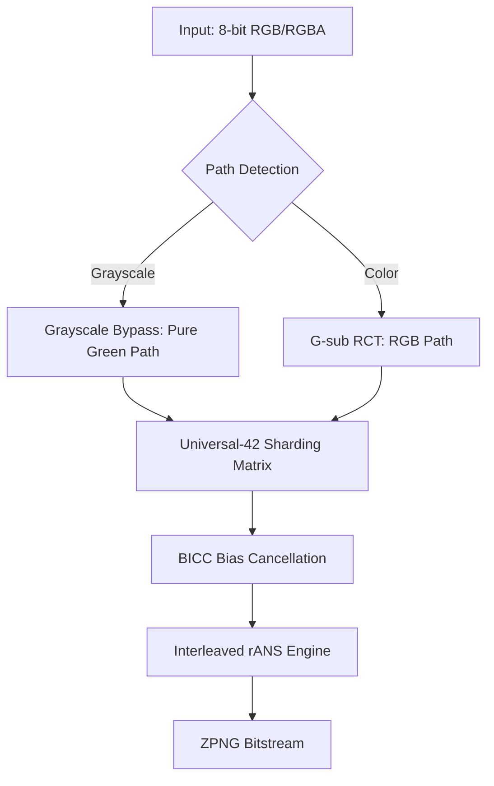

# ZPNG: Python-based Lossless Image Compression

  

A high-performance lossless image compression pipeline implemented in Python with Numba JIT acceleration, utilizing the **Flexible-Shard Architecture** for hierarchical decorrelation and adaptive entropy sharding.


*Visualizing the G-sub Pipeline: Source -> Green Foundation (Grn) -> Modular G-sub Residuals (RD/BD)*

---

This approach manages data representation for lossless compression.

> [!IMPORTANT]
> **Focused on 8-bit RGB/RGBA**: ZPNG is architected specifically for the universal standard of 8-bit digital imaging used in web, game assets, and professional digital photography workflows.

### v6.2.0 Highlights (Flexible-Shard Architecture)
- **Context-Aware Path Architecture**: 
    - **RGB Path**: Universal-42 sharding matrix optimized for cross-channel chrominance residuals.
    - **Grayscale Fast-Path**: Hardware-accelerated monochrome bypass utilizing serialized Green-channel isolation.
- **Universal Sharding Hub (USH)**: Unified matrix-driven context ID derivation using the Universal-42 architecture.
- **BICC (Bias Cancellation)**: Intelligent PDF centering applied to the Green foundation to minimize dispersion.
- **Bitplane rANS (Experimental)**: Hierarchical entropy modeling that treats 8-bit planes as distinct context layers, maximizing redundancy extraction in smooth monochrome gradients.
- **4-Way Interleaved rANS Core**: Branchless decoding achieving high throughput in JIT environments.

---

## 2. Comparison with Existing Formats

- **Compression**: **~25-30% smaller** than standard PNG; competitive with WebP (m6) on high-resolution photography.
- **Efficiency**: Universal-42 sharding provides a balanced profile for both high-frequency noise and low-entropy gradients.
- **Decoding**: Throughput (~25–35 MB/s) on a single thread; scalable up to 100+ MB/s via multi-core batching.

---

## 3. System Requirements & Installation

- **Python Version**: 3.10+ (3.11+ recommended)
- **Python Packages**:
  - `numpy>=1.22.0`, `numba>=0.57.0`, `zstandard>=0.19.0`, `Pillow>=9.0.0`, `pytest>=7.0.0`
- **System Core (Linux)**:
  - Requires `zlib` and `libpng` headers for **Pillow** and **Zstd** I/O (`sudo apt install build-essential zlib1g-dev libpng-dev`).
- **Windows**: Self-contained.

> [!WARNING]
> **JIT Latency**: Initial execution involves a ~30s JIT compilation delay (Numba). Subsequent runs are near-instant.
> **Pro Tip**: Set the environment variable `NUMBA_CACHE_DIR` to a local directory to persist compiled kernels across sessions.

**Installation**:
```bash
pip install numpy>=1.22.0 numba>=0.57.0 zstandard>=0.19.0 Pillow>=9.0.0 pytest>=7.0.0
```

---

## 4. Quick Start

### 4.1 CLI Usage (Recommended)
```bash
# Compress
python main.py compress input.png --optimize

# Decompress
python main.py decompress input.zpng --output restored.png

# Benchmark (Parallel)
python main.py benchmark ./data/gold -n 20 -w 8
```

### 4.2 API Usage
```python
from core import compress_csde, decompress_csde

# 1. Compress Image (RGB/RGBA)
result = compress_csde("input.png", "output.zpng", use_bitplane=False)
print(f"Ratio: {result.ratio:.2%} | Time: {result.enc_time:.2f}s")

# 2. Decompress Image
with open("output.zpng", "rb") as f: payload = f.read()
rgb_arr, dec_time = decompress_csde(payload, "reconstructed.png")
print(f"Dec Time: {dec_time:.2f}s")
```

---

## 5. Technical Architecture

ZPNG follows the **Flexible-Shard Architecture**:
- **Pillar 1: G-sub RCT**: Median-based reversible color transform extracting a stable Green channel foundation.
- **Pillar 2: MED Predictor**: Spatial decorrelation using the Median Edge Detector.
- **Pillar 3: Flexible Sharding Hub (FSH)**: Dynamic 42-shard context mapping based on local intensity and gradient strength (V-Tier).
- **Pillar 4: Interleaved rANS**: 4-way interleaved entropy core for high-instruction-level parallelism.



### 5.1 Dual-Path Strategy
ZPNG implements a **Context-Aware Bypass** logic to handle different image types with optimal efficiency:

*   **RGB Route**: Utilizing the **G-sub RCT**, it extracts a Green foundation (Lead) followed by RD/BD residuals (Lag). It uses a staggered processing window to maintain context consistency across channels.
*   **Grayscale Route**: If R=G=B is detected, the engine activates a specialized monochrome bypass, pruning ~65% of computational overhead. This path is highly optimized for **Bitplane rANS**, which decomposes the 8-bit signal into hierarchical layers to maximize redundancy extraction.

### 5.2 Universal-42 Sharding & Template Matrix
The backbone of ZPNG is the **Universal-42 profile**, mapping pixels into 42 contexts based on V-Tier (gradient strength), Intensity, and Trend. 

For entropy coding, the engine utilizes a **30-Mode Template Matrix**:
- **6 Base Centroids**: Data-driven probability shapes derived from 6,000+ real-world image shards.
- **5 Sigma Scales**: Each centroid is scaled from `0.5` to `1.5` to adapt to different noise levels.
- **Zero-Overhead**: These 30 empirical modes are hardcoded in the decoder, allowing optimal PDF matching without the "Header Tax" of custom frequency tables.

### 5.3 Bitplane rANS (rans_bitplane.py)
For high-density images, ZPNG employs **Shard-Conditioned Bitplane rANS**. Instead of treating the residual as a single 256-symbol alphabet, it decomposes the signal into 2-bit layers. Each layer uses a massive **2,688-way context model** ($42 \text{ Shards} \times 64 \text{ Spatial Patterns}$), allowing the rANS core to isolate structural predictable bits from stochastic noise bits.

---

## 6. Performance Benchmarking (v6.x Unified Hub)
 
 The current engine is benchmarked using the **ZPNG Unified Hub**, providing objective head-to-head comparisons against WebP (Method 6) and JPEG-XL (Effort 7).

### 6.1 Comprehensive Metrics
 Detailed performance data, including compression savings, throughput (MB/s), and competitive win rates, are maintained in [BENCHMARK.md](./BENCHMARK.md).

### 6.2 Usage
```bash
# Use the main entry point
python main.py benchmark ./data/gold -n 50
```

### 6.3 Technical Control Arguments
Common arguments supported by the benchmarking suite:

| Argument | Full Name | Description | Example |
| :--- | :--- | :--- | :--- |
| **-n** | `--num_tests` | Limits the number of processed files. | `python zpng_imgtest.py ./data -n 50` |
| **--offset** | `--offset` | Skips the first N images in the set. | `python zpng_imgtest.py ./data --offset 100` |
| **-w** | `--workers` | Manually sets the number of CPU cores. | `python zpng_cwebp.py ./data -w 8` |
| **-v** | `--verbose` | (imgtest only) Displays detailed logs for each file. | `python zpng_imgtest.py ./data -v` |
| **-rc** | `--recategorize`| (imgtest only) Categorize images by difficulty.| `python zpng_imgtest.py ./data -rc` |
| **--csv** | `--csv` | (imgtest only) Custom path for the results CSV. | `python zpng_imgtest.py ./data --csv test.csv` |
| **--research** | `--research` | (imgtest only) Show G-sub channel redundancy analysis. | `python zpng_imgtest.py ./data --research` |

---

## 7. Official Benchmarks (CLIC / VAL / TRAIN)

Detailed performance metrics and official benchmarks comparing ZPNG-CSDE against WebP and JPEG-XL across industrial datasets are available in the independent benchmark document:

👉 **[View Official Benchmarks (BENCHMARK.md)](./BENCHMARK.md)**

---

## 8. Limitations & Roadmap

- **Bit Depth**: Currently limited to **8-bit** per channel.
- **Color Spaces**: Optimized for **RGB**. No support for CMYK or YCbCr subsampling (G-sub transform is native to RGB).
- **Alpha Channel**: While RGBA is supported, the Alpha channel currently utilizes traditional Zstd compression (Level 1) rather than the high-performance rANS sharding engine used for RGB. Optimization for constant alpha (solidity detection) is a planned future improvement.
- **Threading**: Single-threaded core; parallelization achieved via image-level batching.

## 9. Dataset Sources

To verify the benchmarks or test the engine with standard datasets, you can download the images from the following official sources:

- **DIV2K Data Set - Train & Validation**: [ETH Zurich CVL](https://data.vision.ee.ethz.ch/cvl/DIV2K/)
- **Kodak Data Set**: [Kaggle - Kodak Dataset](https://www.kaggle.com/datasets/sherylmehta/kodak-dataset/data)
- **Clic Data Set**: [Kaggle - CLIC Dataset](https://www.kaggle.com/datasets/mustafaalkhafaji95/clic-dataset?resource=download)
- **Tecnick Data Set**: [SourceForge - TestImages](https://sourceforge.net/projects/testimages/files/SAMPLING/)

---

## 10. Project Background

The ZPNG project is a lossless image compression framework developed by a non-technical lead with limited Python experience and no prior background in information theory. Over an extensive development cycle, the project utilized the agentic AI **Antigravity** to architect and execute complex technical components, including the **Four-Pillar Architecture**, Universal-42 Sharding, and a 4-way interleaved rANS entropy engine. This initiative serves as a technical proof-of-concept for AI-augmented engineering, demonstrating that autonomous agents can bridge the gap between high-level conceptual intent and low-level algorithmic optimization, resulting in a bit-perfect codec that maintains industrial-grade compression ratios against established standards like WebP and JPEG-XL.

## 11. Acknowledgments
This project stands on the shoulders of giants. Special thanks to Dr. Jarosław (Jarek) Duda for his groundbreaking work on Asymmetric Numeral Systems (ANS) and his unwavering commitment to keeping the rANS algorithm in the public domain.

His contribution allows independent developers like us to explore the frontiers of data compression without the constraints of patent barriers, enabling ZPNG to achieve high-performance, bit-perfect results.

---

**Current Version:** v7.2.0 | **License:** Apache 2.0 | **MSE Target:** 0.000000
