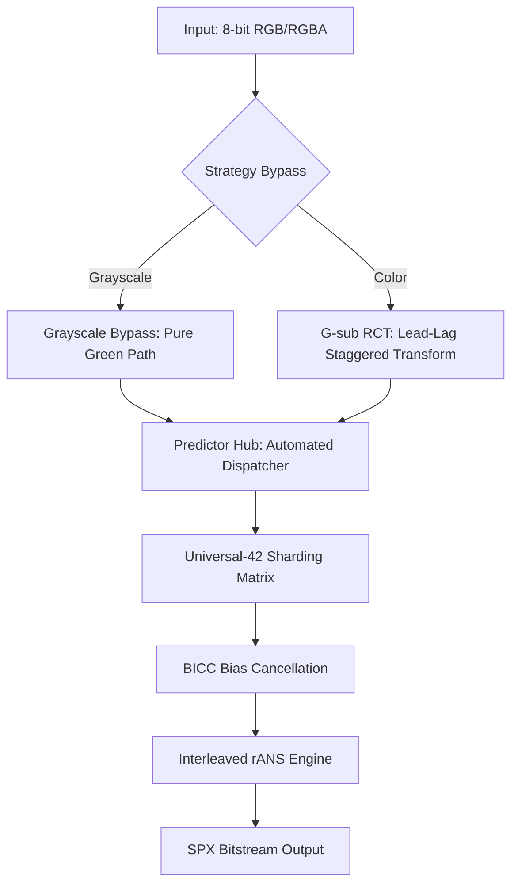

# SPX: Context-Sensitive Data Engine

  

An implementation of lossless image compression using **Entropy Sharding** and **4-way Interleaved rANS**. This project serves as a technical demonstration of achieving competitive compression performance through contextual sharding and statistical modeling rather than high-complexity spatial prediction systems.


*Visualizing the G-sub Pipeline: Source -> Green Foundation (Grn) -> Modular G-sub Residuals (RD/BD)*

---

### v7.5.0 Performance Snapshot

The following data characterizes the throughput and compression efficiency across standard datasets.

| Dataset | Type | SPX BPP | **Savings (vs PNG)** | **SPX Enc Speed** | WebP (M6) Speed | JXL (E7) Speed |
| :--- | :--- | :--- | :--- | :--- | :--- | :--- |
| **Kodak** | RGB | **9.83** | **-24.66 %** | **26.50 MB/s** | 0.35 MB/s | 6.51 MB/s |
| **CLIC '25** | RGB | **8.03** | **-28.52 %** | **29.46 MB/s** | 1.10 MB/s | 5.35 MB/s |
| **DIV2K Val**| 2K | **9.20** | **-27.46 %** | **42.36 MB/s** | 1.36 MB/s | 6.08 MB/s |
| **Tecnick** | Gray | **1.68** | **-27.62 %** | **7.19 MB/s** | 0.28 MB/s | 2.19 MB/s |

> [!NOTE]
> **Hardware Benchmark Environment**:
> - **CPU**: AMD Ryzen 5 3500X (6-Core, 3.60 GHz)
> - **RAM**: 32.0 GB
> - **OS**: Windows 11 (64-bit, x64)

#### **Technical Comparison**
- **Encoding Speed**: SPX is consistently **25x–150x faster** than WebP (Method 6) and **5x–7x faster** than JPEG-XL (Effort 7).
- **Quality Assurance**: Bit-perfect reconstruction across all 1,500+ test images (**MSE = 0.00000000**).
- **Core Efficiency**: High instruction-level parallelism (ILP) via 4-way interleaved rANS.

*Full comparative analysis vs. standard formats is available in [Official Benchmarks](./technical/BENCHMARK.md).*

---

### v7.5.0 Technical Analysis (Context-Sensitive Data Engine)
- **Core Workflow**: Optimized pipeline featuring **G-sub** $\rightarrow$ **Predictor Hub** $\rightarrow$ **Sharding** $\rightarrow$ **rANS**.
- **Predictor Dispatcher (New)**: Decoupled hub in `predictor.py` supporting seamless toggling between Standard MED and Edge-Tuned variants.
- **Context-Aware Path Architecture**: 
    - **RGB Path**: Universal-42 sharding matrix optimized for cross-channel chrominance residuals.
    - **Grayscale Fast-Path**: Hardware-accelerated monochrome bypass utilizing serialized Green-channel isolation.
- **Universal Sharding Hub (USH)**: Unified matrix-driven context ID derivation using the Universal-42 architecture.
- **BICC (Bias Cancellation)**: Intelligent PDF centering applied to residuals to minimize dispersion.
- **Bitplane rANS**: Hierarchical entropy modeling that treats 8-bit planes as distinct context layers, maximizing redundancy extraction.
- **4-Way Interleaved rANS Core**: Vectorized entropy engine achieving optimized instruction-level parallelism.

---

## 2. Comparison with Existing Formats

- **Compression**: **~25-30% smaller** than standard PNG; competitive with WebP (m6) on high-resolution photography.
- **Efficiency**: Universal-42 sharding provides a balanced profile for both high-frequency noise and low-entropy gradients.
- **Decoding**: Throughput (~25–35 MB/s) on a single thread; scalable up to 100+ MB/s via multi-core batching.

---

## 3. System Requirements & Installation

- **Python Version**: 3.10+ (3.11+ recommended)
- **Python Packages**:
  - `numpy>=1.22.0`, `numba>=0.57.0`, `zstandard>=0.19.0`, `Pillow>=9.0.0`, `pytest>=7.0.0`
- **System Core (Linux)**:
  - Requires `zlib` and `libpng` headers for **Pillow** and **Zstd** I/O (`sudo apt install build-essential zlib1g-dev libpng-dev`).
- **Windows**: Self-contained.

> [!WARNING]
> **JIT Latency**: Initial execution involves a ~30s JIT compilation delay (Numba). Subsequent runs are near-instant.
> **Pro Tip**: Set the environment variable `NUMBA_CACHE_DIR` to a local directory to persist compiled kernels across sessions.

**Installation**:
```bash
pip install numpy>=1.22.0 numba>=0.57.0 zstandard>=0.19.0 Pillow>=9.0.0 pytest>=7.0.0
```

---

## 4. Quick Start

### 4.1 CLI Usage (Recommended)
```bash
# Compress
python main.py compress input.png --optimize

# Decompress
python main.py decompress input.spx --output restored.png

# Benchmark (Parallel)
python main.py benchmark ./path/to/images -n 20 -w 8
```

### 4.2 API Usage
```python
from core import compress_spx, decompress_spx

# 1. Compress Image (RGB/RGBA)
result = compress_spx("input.png", "output.spx", use_bitplane=False)
print(f"Ratio: {result.ratio:.2%} | Time: {result.enc_time:.2f}s")

# 2. Decompress Image
with open("output.spx", "rb") as f: payload = f.read()
rgb_arr, dec_time = decompress_spx(payload, "reconstructed.png")
print(f"Dec Time: {dec_time:.2f}s")
```

### 4.3 Windows Batch Utility (`test.bat`)
For Windows users, a convenient batch wrapper is provided for benchmarking:
```powershell
# Run benchmark on a custom folder
.\test bench C:\images\my_dataset

# Run solo SPX test on a relative path
.\test spx ./data/local_test

# Pass additional arguments (e.g., limit to 10 images)
.\test bench ./my_images -n 10
```
> [!NOTE]
> The utility supports both raw absolute/relative paths and pre-defined aliases (like `gold`, `clic`, `kodak`) if the corresponding data is present in your local `./data` directory.

---

## 5. Technical Architecture & Execution Flow

SPX follows a strictly defined **Four-Step Pipeline** to transform raw pixels into a highly compressed bitstream:

### 5.1 Scientific Execution Workflow
1.  **Step 1: G-sub (Green-Subtract RCT)**: Extracts the Green (G) channel as the foundation and calculates residuals ($RD = R - G$, $BD = B - G$) to eliminate inter-channel redundancy.
2.  **Step 2: Predictor Hub (Spatial Decorrelation)**: Performs context-aware spatial prediction. The project utilizes a **Modular Dispatcher** allowing seamless switching between **med_standard** (Stable) and **med_edge_tuned** (Experimental) kernels.
3.  **Step 3: Sharding (Contextual Hub)**: Maps residuals into **42 discrete Shards** (Universal-42) based on local intensity and gradient-tier ($V$-Tier) behavior.
4.  **Step 4: rANS (Entropy Coding)**: Consumes the sharded data using a **4-way interleaved Range ANS** engine for near-optimal bit-perfect compression.



### 5.2 Deep-Dive Technical Series

For detailed algorithmic specifications, refer to the following documentation in the `technical/` directory:

*   [**01. PREDICTOR.md**](./technical/1.%20PREDICTOR.md): Detailed logic of the Spatial Dispatcher and MED variations.
*   [**02. SHARD_TEMPLATE.md**](./technical/2.%20SHARD_TEMPLATE.md): Specification of the Universal-42 matrix and context derivation.
*   [**03. RANS_MODE.md**](./technical/3.%20RANS_MODE.md): Architecture of the 4-way Interleaved rANS core and probability modeling.
*   [**04. DATASET_FINGERPRINT.md**](./technical/4.%20DATASET_FINGERPRINT.md): Statistical performance profiling across industrial datasets.

### 5.3 Dual-Path Strategy
SPX implements a **Context-Aware Bypass** logic to handle different image types with optimal efficiency:

*   **RGB Route**: Utilizing the **G-sub RCT**, it extracts a Green foundation (Lead) followed by RD/BD residuals (Lag). It uses a staggered processing window to maintain context consistency across channels.
*   **Grayscale Route**: If R=G=B is detected, the engine activates a specialized monochrome bypass, pruning ~65% of computational overhead. This path is highly optimized for **Bitplane rANS**, which decomposes the 8-bit signal into hierarchical layers to maximize redundancy extraction.

### 5.4 Universal-42 Sharding & Template Matrix
The backbone of SPX is the **Universal-42 profile**, mapping pixels into 42 contexts based on V-Tier (gradient strength), Intensity, and Trend. This "Sharding" application allows the coder to isolate edges from smooth gradients, applying unique probability models to each.

For entropy coding, the engine utilizes a **30-Mode Template Matrix**:
- **6 Base Centroids**: Data-driven probability shapes derived from 6,000+ real-world image shards.
- **5 Sigma Scales**: Each centroid is scaled from `0.5` to `1.5` to adapt to different noise levels.
- **Zero-Overhead**: These 30 empirical modes are hardcoded in the decoder, allowing optimal PDF matching without the "Header Tax" of custom frequency tables.

### 5.5 Bitplane rANS & Entropy Core
For high-density images, SPX employs **Shard-Conditioned Bitplane rANS**. Instead of treating the residual as a single 256-symbol alphabet, it decomposes the signal into 2-bit layers. Each layer uses a massive **2,688-way context model** ($42 \text{ Shards} \times 64 \text{ Spatial Patterns}$), allowing the rANS core to isolate structural predictable bits from stochastic noise bits.

The **Interleaved rANS** engine further optimizes throughput by managing multiple state variables in a single loop, effectively treating the entropy coding as a vectorized operation.

---

## 6. Performance Benchmarking (v7.x Unified Hub)
 
 The current engine is benchmarked using the **SPX Unified Hub**, providing objective head-to-head comparisons against WebP (Method 6) and JPEG-XL (Effort 7).

### 6.1 Comprehensive Metrics
 Detailed performance data, including compression savings, throughput (MB/s), and competitive win rates, are maintained in [technical/BENCHMARK.md](./technical/BENCHMARK.md).

### 6.2 Usage
```bash
# Use the main entry point
python main.py benchmark C:\datasets\my_images -n 50

# Windows Shortcut (Batch)
.\test bench ./local_folder -n 50
```

### 6.3 Technical Control Arguments
Common arguments supported by the benchmarking suite:

| Argument | Full Name | Description | Example |
| :--- | :--- | :--- | :--- |
| **-n** | `--num_tests` | Limits the number of processed files. | `-n 50` |
| **--offset** | `--offset` | Skips the first N images in the set. | `--offset 100` |
| **-w** | `--workers` | Manually sets the number of CPU cores. | `-w 8` |
| **--codec** | `--codec` | Selects codec: `spx`, `webp`, `jxl`, `bench`. | `--codec bench` |
| **--reclassify**| `--reclassify`| Categorize images into Easy/Hard/Hell folders. | `--reclassify` |
| **--build** | `--build` | Assemble dataset: `PATH E H HELL`. | `--build my_set 10 10 5` |

#### **Advanced CLI Examples**
```powershell
# 1. Analyze a specific slice of a large dataset
python main.py benchmark C:\data -n 100 --offset 500

# 2. Extract specific difficulty levels from a results run
# This copies processed files into ./data/DIV2K_Easy, etc.
python main.py benchmark ./my_images --reclassify

# 3. Create a synthetic dataset (10 Easy, 10 Hard, 5 Hell images)
# Resulting images are saved to './data/balanced_set'
python main.py benchmark --build balanced_set 10 10 5
```

---

## 7. Official Benchmarks (CLIC / DIV2K / TECNICK / KODAK)

Detailed performance metrics and official benchmarks comparing SPX against WebP and JPEG-XL across industrial datasets are available in the independent benchmark document:

👉 **[View Official Benchmarks (BENCHMARK.md)](./technical/BENCHMARK.md)**

---

## 8. Limitations & Roadmap

- **Bit Depth**: Currently limited to **8-bit** per channel.
- **Color Spaces**: Optimized for **RGB**. No support for CMYK or YCbCr subsampling (G-sub transform is native to RGB).
- **Alpha Channel**: While RGBA is supported, the Alpha channel currently utilizes traditional Zstd compression (Level 1) rather than the high-performance rANS sharding engine used for RGB. Optimization for constant alpha (solidity detection) is a planned future improvement.
- **Threading**: Single-threaded core; parallelization achieved via image-level batching.

## 9. Dataset Sources

To verify the benchmarks or test the engine with standard datasets, you can download the images from the following official sources:

- **DIV2K Data Set - Train & Validation**: [ETH Zurich CVL](https://data.vision.ee.ethz.ch/cvl/DIV2K/)
- **Kodak Data Set**: [Kaggle - Kodak Dataset](https://www.kaggle.com/datasets/sherylmehta/kodak-dataset/data)
- **Clic Data Set**: [Kaggle - CLIC Dataset](https://www.kaggle.com/datasets/mustafaalkhafaji95/clic-dataset?resource=download)
- **Tecnick Data Set**: [SourceForge - TestImages](https://sourceforge.net/projects/testimages/files/SAMPLING/)

---

## 10. Project Background

The SPX project is a lossless image compression framework developed through an extensive research cycle. The project utilized the agentic AI **Antigravity** to architect technical components, including the **Four-Pillar Architecture**, Universal-42 Sharding, and a 4-way interleaved rANS entropy engine. This initiative serves as a technical proof-of-concept for AI-augmented engineering, demonstrating that autonomous agents can assist in algorithmic optimization, resulting in a bit-perfect codec that maintains competitive compression ratios against established standards like WebP and JPEG-XL.

## 11. Acknowledgments
This project utilizes the rANS algorithm developed by Dr. Jarosław (Jarek) Duda. His work on Asymmetric Numeral Systems (ANS) provided the mathematical foundation for the entropy core.

---

**Current Version:** v7.5.0 | **License:** Apache 2.0 | **MSE Target:** 0.00000000
