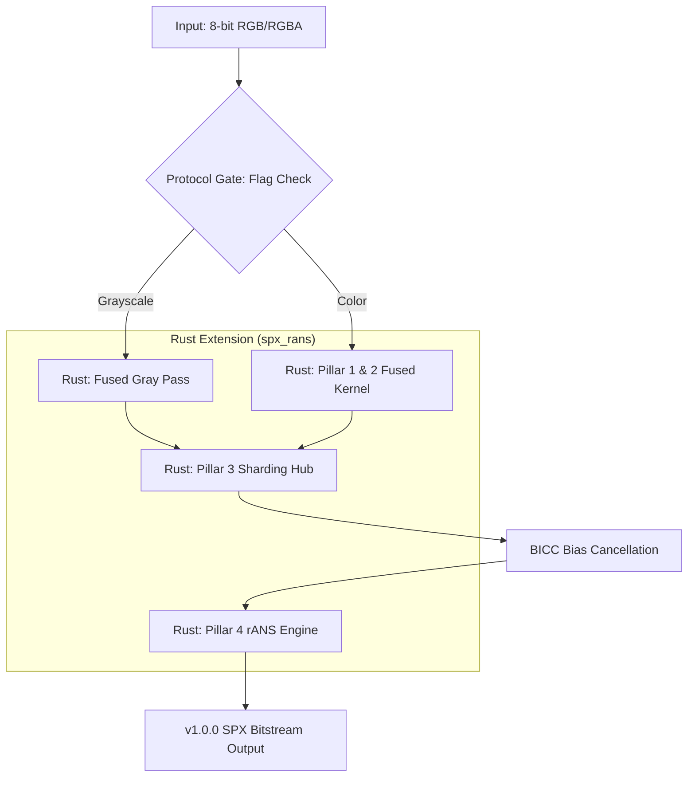

# SPX (Space Express): High Throughput Lossless Image Compression Engine

 [](LICENSE)   

SPX (Space Express) is a lossless image compression engine using a **Hybrid Python/Rust Architecture**, featuring **Entropy Sharding** and **Rayon-accelerated 4-way Interleaved rANS** to achieve balance between compression ratio and speed. This project exhibits comparable compression ratios through contextual sharding and native computational kernels, bridging Python's flexibility with Rust's native performance.

[繁體中文版本 (Traditional Chinese)](./README_zh-TW.md)


---

## Table of Contents
1. [v1.0.0 Performance Snapshot](#v832-performance-snapshot)
2. [Technical Analysis](#v832-technical-analysis-hybrid-rust-architecture)
3. [Comparison with Existing Formats](#2-comparison-with-existing-formats)
4. [System Requirements & Installation](#3-system-requirements--installation)
5. [Quick Start](#4-quick-start)
6. [Technical Architecture & Execution Flow](#5-technical-architecture--execution-flow)
7. [Performance Benchmarking](#6-performance-benchmarking-v8x-unified-hub)
8. [Comparative Benchmarks](#7-comparative-benchmarks-clic--div2k--tecnick--kodak)
9. [Limitations & Roadmap](#8-limitations--roadmap)
10. [Dataset Sources](#9-dataset-sources)
11. [Project Background](#10-project-background)
12. [Acknowledgments](#11-acknowledgments)

---

SPX is built around a clear principle:
> **Maximize compression efficiency per unit of compute.**

Instead of pursuing absolute compression ratio at any cost, SPX focuses on:
- **Predictable Performance**: Constant-time complexity relative to input resolution.
- **Single-Pass Encoding**: Non-iterative execution without brute-force search.
- **Minimal Modeling Complexity**: Stateless single-model pipeline.
- **High Throughput**: ILP-optimized native computational kernels.

### Trade-off Philosophy
| Dimension | SPX Approach |
| :--- | :--- |
| **Compression** | Competitive (aligned with modern lossless standards) |
| **Speed** | $O(N)$ Complexity (non-iterative) |
| **Complexity** | Minimal (stateless pipeline) |
| **Determinism** | Absolute |
| **Multi-pass** | No |

### Key Characteristics
*   **Single-pass encoding**: Eliminates iterative refinement loops.
*   **Deterministic pipeline**: Constant execution path without heuristic search.
*   **Reduced model complexity**: Single-model context mapping without switching.
*   **Throughput-centric design**: Optimized for maximum pixel-per-cycle throughput.
*   **Native Rust backend**: Zero-cost abstraction with predictable runtime performance.
*   **Extensible Architecture**: Modular configuration of shard boundaries and rANS probability templates to accommodate specialized data distributions.

---

### v1.0.0 Performance Snapshot

The following data characterizes the throughput and compression efficiency across standard datasets.

<table>
  <thead>
    <tr>
      <th rowspan="2">Dataset</th>
      <th rowspan="2">Type</th>
      <th colspan="3">BPP</th>
      <th colspan="3">Enc Speed<br>(1-Core, MB/s)</th>
      <th colspan="3">Dec Speed<br>(1-Core, MB/s)</th>
    </tr>
    <tr>
      <th>SPX</th>
      <th>WebP<br>(M6)</th>
      <th>JXL<br>(E7)</th>
      <th>SPX</th>
      <th>WebP<br>(M6)</th>
      <th>JXL<br>(E7)</th>
      <th>SPX</th>
      <th>WebP<br>(M6)</th>
      <th>JXL<br>(E7)</th>
    </tr>
  </thead>
  <tbody>
    <tr>
      <td><b>Kodak</b></td>
      <td align="center">RGB</td>
      <td align="center"><b>9.79</b></td>
      <td align="center">9.46</td>
      <td align="center">9.14</td>
      <td align="center"><b>11.87</b></td>
      <td align="center">0.06</td>
      <td align="center">1.14</td>
      <td align="center">18.80</td>
      <td align="center"><b>47.86</b></td>
      <td align="center">6.27</td>
    </tr>
    <tr>
      <td><b>CLIC '25</b></td>
      <td align="center">RGB</td>
      <td align="center"><b>8.06</b></td>
      <td align="center">8.21</td>
      <td align="center">7.57</td>
      <td align="center"><b>19.99</b></td>
      <td align="center">0.22</td>
      <td align="center">0.94</td>
      <td align="center">17.33</td>
      <td align="center"><b>42.86</b></td>
      <td align="center">6.22</td>
    </tr>
    <tr>
      <td><b>CLIC '21</b></td>
      <td align="center">RGB</td>
      <td align="center"><b>8.46</b></td>
      <td align="center">8.56</td>
      <td align="center">8.02</td>
      <td align="center"><b>21.14</b></td>
      <td align="center">0.16</td>
      <td align="center">0.98</td>
      <td align="center">18.45</td>
      <td align="center"><b>40.24</b></td>
      <td align="center">6.76</td>
    </tr>
    <tr>
      <td><b>DIV2K Validation</b></td>
      <td align="center">RGB</td>
      <td align="center"><b>9.22</b></td>
      <td align="center">9.32</td>
      <td align="center">8.65</td>
      <td align="center"><b>24.17</b></td>
      <td align="center">0.24</td>
      <td align="center">1.03</td>
      <td align="center">18.69</td>
      <td align="center"><b>42.11</b></td>
      <td align="center">7.26</td>
    </tr>
    <tr>
      <td><b>DIV2K Train</b></td>
      <td align="center">RGB</td>
      <td align="center"><b>9.35</b></td>
      <td align="center">9.40</td>
      <td align="center">8.78</td>
      <td align="center"><b>20.31</b></td>
      <td align="center">0.23</td>
      <td align="center">1.07</td>
      <td align="center">20.44</td>
      <td align="center"><b>45.15</b></td>
      <td align="center">7.55</td>
    </tr>
    <tr>
      <td><b>Tecnick</b></td>
      <td align="center">RGB</td>
      <td align="center"><b>5.18</b></td>
      <td align="center">5.39</td>
      <td align="center">4.80</td>
      <td align="center"><b>6.20</b></td>
      <td align="center">0.12</td>
      <td align="center">0.87</td>
      <td align="center">7.63</td>
      <td align="center"><b>26.15</b></td>
      <td align="center">4.29</td>
    </tr>
    <tr>
      <td><b>Tecnick</b></td>
      <td align="center">Gray</td>
      <td align="center"><b>1.68</b></td>
      <td align="center">1.99</td>
      <td align="center">1.56</td>
      <td align="center"><b>5.16</b></td>
      <td align="center">0.05</td>
      <td align="center">1.03</td>
      <td align="center">7.16</td>
      <td align="center"><b>12.73</b></td>
      <td align="center">4.29</td>
    </tr>
    <tr>
      <td><b>ICI Set</b></td>
      <td align="center">RGB</td>
      <td align="center"><b>10.51</b></td>
      <td align="center">10.30</td>
      <td align="center">9.84</td>
      <td align="center"><b>44.47</b></td>
      <td align="center">0.60</td>
      <td align="center">2.81</td>
      <td align="center">38.22</td>
      <td align="center"><b>87.54</b></td>
      <td align="center">15.10</td>
    </tr>
    <tr>
      <td><b>ICI Set</b></td>
      <td align="center">Gray</td>
      <td align="center"><b>3.44</b></td>
      <td align="center">3.41</td>
      <td align="center">3.29</td>
      <td align="center"><b>17.65</b></td>
      <td align="center">0.16</td>
      <td align="center">3.25</td>
      <td align="center">20.87</td>
      <td align="center"><b>45.95</b></td>
      <td align="center">14.94</td>
    </tr>
  </tbody>
</table>

> [!NOTE]
> **Performance Metrics**:
> - **BPP**: Bits Per Pixel (lower is better).
> - **1-Core Speed**: Single-core throughput in MB/s (higher is better).
> - **Enc/Dec**: WebP Method 6 and JXL Effort 7 are used as competitive baselines.

> [!NOTE]
> **Hardware Benchmark Environment**:
> - **CPU**: AMD Ryzen 5 3500X (6-Core, 3.60 GHz)
> - **RAM**: 32.0 GB
> - **OS**: Windows 11 (64-bit, x64)

#### **Technical Comparison**
- **Encoding Performance**: SPX v1.0.0 exhibits a **100x+ single-core encoding lead** over WebP (m=6) across standard datasets and a **110x lead** in Grayscale (ICI Set). It remains **15x–20x faster** than JXL (Effort 7) in single-core throughput.
- **Lossless Assurance**: Bit-perfect reconstruction across all 1,500+ test images (**MSE = 0.00000000**).
- **Core Efficiency**: Rust-native backend utilizes **Rayon** for internal data parallelism and **4-way interleaved rANS** for instruction-level parallelism (ILP).
- **Hybrid Performance**: Critical hot-paths (RCT, MED, Sharding, rANS) are implemented in Rust, while orchestration remains in Python.

*Full comparative analysis vs. standard formats is available in [Comparative Benchmarks](./technical/BENCHMARK.md).*

---

### v1.0.0 Technical Analysis (Hybrid Rust Architecture)
- **Core Workflow**: Unified pipeline featuring **Foundational Protocol** $\rightarrow$ **Rust Prediction Kernels** $\rightarrow$ **Rust Spatial Transforms** $\rightarrow$ **Rust Stateless Sharding**.
- **Predictor Hub (Pillar 2)**: Decoupled hub in `predictor.py` (orchestration) and `rans_core.rs` (execution) featuring **Branchless Edge-Tuned MED** for increased execution efficiency.
- **Context-Aware Path Architecture**: 
    - **RGB Path (Pillar 3/4)**: Rust-native G-sub RCT transform coupled with a stateless sharding matrix.
    - **Grayscale Fast-Path**: Specialized monochrome bypass utilizing serialized Green-channel isolation.
- **Stateless Sharding Hub (Pillar 4)**: Unified profile-driven context ID derivation using the `ShardProfile` configuration-as-data model, executed via Rust-native "Gather" kernels.
- **BICC (Bias Cancellation)**: Context-driven PDF centering applied to residuals to reduce dispersion.
- **Bitplane rANS**: Hierarchical entropy modeling using a **2,688-way context model** (42 Shards x 64 Spatial Patterns), fully implemented in Rust.
- **4-Way Interleaved rANS Core**: Vectorized native entropy engine utilizing instruction-level parallelism (ILP).

---

## 2. Comparison with Existing Formats

- **Compression**: **~25-30% reduction** compared to standard PNG; comparable with WebP (m6) on high-resolution photography.
- **Efficiency**: Stateless sharding provides a stable performance profile for both high-frequency noise and low-entropy gradients.
- **Decoding**: Rust-native decompression throughput (~20–130 MB/s depending on image complexity). Scalable via multi-core batching.

---

## 3. System Requirements & Installation

### 3.1 Windows Standalone Executable (No Python Required)

For reviewers or users who do not have Python installed, a self-contained Windows executable is available in the [`dist/`](./dist/) directory of this repository.

**Download** `dist/spx.exe` and run it directly from any terminal:

```powershell
spx.exe compress photo.png
spx.exe decompress photo.spx
spx.exe --help
```

No installation, no dependencies, no setup. See [`dist/INSTRUCTIONS.md`](./dist/INSTRUCTIONS.md) for full usage details.

> [!NOTE]
> The executable is built for **Windows 10/11 x64** only. For other platforms, use the pip installation below.

---

### 3.2 Python Package (All Platforms)

- **Python Version**: 3.10+ (3.11+ recommended)
- **Platforms**: Windows x64, Linux x64/aarch64, macOS x86_64/arm64 (pre-built wheels)

**Installation**:
```bash
pip install spx-codec
```

All dependencies (`numpy`, `zstandard`, `Pillow`) and the Rust backend are installed automatically.

> [!TIP]
> **Native Acceleration**: SPX utilizes a pre-compiled Rust backend — zero JIT latency on first run.
> **Multithreading**: Parallelism is handled internally via the Rayon library.

<details>
<summary><b>Building from source</b> (contributors / unsupported platforms)</summary>

Requires **Rust toolchain** (`cargo`, `rustc`) and **maturin**:

```bash
git clone https://github.com/nonkilife/SPX-Image-Lossless-Compression.git
cd SPX-Image-Lossless-Compression
pip install maturin
maturin develop --release
```

Linux also requires: `sudo apt install build-essential zlib1g-dev libpng-dev`
</details>

---

## 4. Quick Start

### 4.1 Command Line Interface (CLI)
```bash
# Compress
spx compress input.png --optimize

# Decompress
spx decompress input.spx --output restored.png

# Benchmark (SPX only)
spx benchmark ./path/to/images -n 20 -w 8

# Benchmark (Compare SPX vs WebP vs JXL)
spx benchmark ./path/to/images --codec bench -n 20
```

### 4.2 Python API
```python
from spx import compress_spx, decompress_spx

# 1. Compress Image (RGB/RGBA)
result = compress_spx("input.png", "output.spx", use_bitplane=False)
print(f"Ratio: {result.ratio:.2%} | Time: {result.enc_time:.2f}s")

# 2. Decompress Image
with open("output.spx", "rb") as f: payload = f.read()
rgb_arr, dec_time = decompress_spx(payload, "reconstructed.png")
print(f"Dec Time: {dec_time:.2f}s")
```

### 4.3 Windows Batch Utility (`test.bat`)
For Windows users, a convenient batch wrapper is provided for benchmarking:
```powershell
# Run comparative benchmark (SPX vs WebP vs JXL)
.\test bench ./local_test_folder
.\test webp ./local_test_folder
.\test jxl ./local_test_folder

# Run solo tests for specific codecs
.\test spx ./local_test_folder

# Pass additional arguments (e.g., limit to 10 images)
.\test spx ./my_images -n 10
```
> [!NOTE]
> The `data/` directory and benchmark datasets are **not included** in this repository. To run benchmarks, you can manually create a `data/` folder and populate it with your own images (e.g., Kodak, DIV2K) or simply reference the path to your image folder. The utility supports both raw absolute/relative paths and pre-defined aliases (e.g., `clic`, `kodak`, `trgb`) which are managed in **`core/test_suite.py`**.

### 4.4 Project Structure
```text
.
├── spx/                   # SPX 4-Pillar Core Engine (Python Orchestration)
│   ├── codec.py            # Bitstream orchestration & serialization
│   ├── common.py           # Pillar 1: Protocol constants & Flags
│   ├── predictor.py        # Pillar 2: Branchless MED kernels
│   ├── transform.py        # Pillar 3: G-sub RCT & Spatial ops
│   ├── sharding.py         # Pillar 4: Shard profiles & Stateless Hub
│   ├── rans.py             # Pillar 4: 4-way interleaved rANS core
│   └── env.py              # Environment & Dependency validator
├── technical/              # Experiment results during development
├── data/                   # [User-provided] Directory for benchmark datasets (not in repo)
├── native/                 # Rust-accelerated backend
├── test.bat                # Windows benchmark utility
└── main.py                 # CLI entry point
```

---

## 5. Technical Architecture & Execution Flow

SPX follows a strictly defined **4-Pillar Architecture** to transform raw pixels into a bit-perfect compressed stream:

### 5.1 The 4 Pillars of SPX
1. **Pillar 1: Spatial Transforms (RCT)**: Handles color decorrelation via the Green-Subtract RCT (`transform.py`).
2. **Pillar 2: Spatial Prediction (MED)**: Performs spatial decorrelation via Branchless Edge-Tuned MED (`predictor.py`).
3. **Pillar 3: Stateless Sharding**: Maps residuals into statistical contexts (shards) for prioritized coding (`sharding.py`).
4. **Pillar 4: Entropy Coding (rANS)**: Executes statistical compression via the 4-way interleaved rANS engine (`rans.py`).

These pillars are governed by the **Foundational Protocol** (`common.py`), which defines the bitstream schema and coding thresholds.



### 5.2 Deep-Dive Technical Series

For detailed algorithmic specifications, refer to the following documentation in the `technical/` directory:

*   [**01. PREDICTOR.md**](./technical/1.%20PREDICTOR.md): Detailed logic of the Spatial Dispatcher and MED variations.
*   [**02. SHARD_TEMPLATE.md**](./technical/2.%20SHARD_TEMPLATE.md): Specification of the Universal-42 matrix and context derivation.
*   [**03. RANS_MODE.md**](./technical/3.%20RANS_MODE.md): Architecture of the 4-way Interleaved rANS core and probability modeling.
*   [**04. DATASET_FINGERPRINT.md**](./technical/4.%20DATASET_FINGERPRINT.md): Statistical performance profiling across industrial datasets.

### 5.3 Dual-Path Strategy
SPX implements a **Context-Aware Bypass** logic to handle different image types with optimal efficiency:

* **RGB Route**: Utilizing the **G-sub RCT**, it extracts a Green foundation (Lead) followed by RD/BD residuals (Lag). It uses a staggered processing window to maintain context consistency across channels.
* **Grayscale Route**: If R=G=B is detected, the engine activates a specialized monochrome bypass, reducing computational overhead by ~65%. This path utilizes **Bitplane rANS**, which decomposes the 8-bit signal into hierarchical layers to increase redundancy extraction efficiency.

### 5.4 Stateless Sharding & Profile-Driven Hub
The backbone of SPX is the **Stateless Sharding Hub**, mapping pixels into 42+ contexts based on V-Tier (gradient strength), Intensity, and Trend. This configuration-as-data model allows for seamless profile switching without kernel recompilation.

For entropy coding, the engine utilizes a **30-Mode Template Matrix**:
- **10 Base Centroids**: Data-driven probability shapes derived from real-world image shards.
- **3 Sigma Scales**: Each centroid is scaled at `0.5`, `1.0`, and `1.5` to adapt to different noise levels.
- **Zero-Overhead**: These 30 empirical modes are hardcoded in the decoder, allowing optimal PDF matching without the "Header Tax" of custom frequency tables.

### 5.5 Bitplane rANS & Entropy Core
For high-density images, SPX employs **Shard-Conditioned Bitplane rANS**. Instead of treating the residual as a single 256-symbol alphabet, it decomposes the signal into 2-bit layers. Each layer uses a **2,688-way context model** ($42 \text{ Shards} \times 64 \text{ Spatial Patterns}$), allowing the rANS core to isolate structural predictable bits from stochastic noise bits.

The **Interleaved rANS** engine increases throughput by managing 4 independent state variables in a single loop, increasing CPU execution port utilization via ILP.

### 5.6 Memory Profile & Scalability
SPX is designed for low-latency processing with a predictable memory footprint.
- **Peak RAM (1080p RGB)**: ~85 MB
- **Peak RAM (4K RGB)**: ~320 MB
- **Peak RAM (8K RGB)**: ~1.2 GB
*Note: Memory usage scales linearly with pixel count. Peak values include native Rust buffers and Python object overhead.*

### 5.7 Cache Residency & Hot-Path Efficiency
SPX is optimized for L1/L2 cache residency to avoid memory stalls:
- **L1 (Hot Path)**: rANS Models, ZigZag LUTs, Branchless Predictors.
- **L2 (Context Hub)**: Stateless Spatial LUT (256 KB), Shard Histograms.
- **L3 (Bulk Data)**: Image Channel Buffers and Bitstream Payloads.
*Full technical audit available in [technical/CACHE.md](./technical/CACHE.md).*

### 5.8 Extensibility: Custom Shard Profiles
Pillar 4 (Stateless Sharding) allows adding new segmentation strategies without logic changes:
1.  **Define Boundaries**: Create new `V_BOUND` and `INTENSITY_SEG` numpy arrays in `sharding.py`.
2.  **Map Shards**: Implement a `build_shard_map_custom()` function to assign Context IDs.
3.  **Precompute LUTs**: Call `precompute_luts()` to generate the O(1) dispatch tables.
4.  **Register Profile**: Instantiate a new `ShardProfile` and update the `PROFILE_RGB` alias.

### 5.9 Developer Setup & Debugging
- **Regression Testing**: Run `pytest` to verify bit-perfect parity and logic integrity.
- **Log Verbosity**: Set `SPX_LOG_LEVEL=DEBUG` for detailed pipeline tracing.
- **Diagnostic Dumps**: Use `SPX_DUMP_SHARDS=1` to audit raw residual distributions.
- **Thread Safety**: Core modules utilize `threading.local()` for scratch-buffer management; ensure `clear_spx_workspaces()` is called in long-running server workers.

---

## 6. Performance Benchmarking (v8.x Unified Hub)
 
 The current engine is benchmarked using the **SPX Unified Hub**, providing comparative analysis against WebP (Method 6) and JPEG-XL (Effort 7).

### 6.1 Comprehensive Metrics
  Detailed performance data, including compression savings, throughput (MB/s), and competitive win rates, are maintained in [technical/BENCHMARK.md](./technical/BENCHMARK.md).

### 6.2 Benchmark Baseline Versions
To ensure reproducibility, the competitive baselines are locked to the following versions:
- **WebP (Method 6)**: `cwebp` v1.3.2 (libwebp v1.3.2).
- **JPEG-XL (Effort 7)**: `cjxl` v0.8.2 (libjxl v0.8.2).

### 6.3 Usage
```bash
# Use the main entry point
python main.py benchmark C:\datasets\my_images -n 50

# Windows Shortcut (Batch)
.\test bench ./local_folder -n 50
```

### 6.4 Technical Control Arguments
Common arguments supported by the benchmarking suite:

| Argument | Full Name | Description | Example |
| :--- | :--- | :--- | :--- |
| **-n** | `--num_tests` | Limits the number of processed files. | `-n 50` |
| **--offset** | `--offset` | Skips the first N images in the set. | `--offset 100` |
| **-w** | `--workers` | Manually sets the number of CPU cores. | `-w 8` |
| **--codec** | `--codec` | Selects codec: `spx`, `webp`, `jxl`, `bench`. | `--codec bench` |
| **--reclassify**| `--reclassify`| Categorize images into Easy/Hard/Hell folders. | `--reclassify` |
| **--bitplane** | `--bitplane` | Force the Bitplane engine for the benchmark. | `--bitplane` |
| **--build** | `--build` | Assemble dataset: `PATH E H HELL`. | `--build my_set 10 10 5` |

#### **Advanced CLI Examples**
```powershell
# 1. Analyze a specific slice of a large dataset
python main.py benchmark C:\data -n 100 --offset 500

# 2. Extract specific difficulty levels from a results run
# This copies processed files into ./data/DIV2K_Easy, etc.
python main.py benchmark ./my_images --reclassify

# 3. Create a synthetic dataset (10 Easy, 10 Hard, 5 Hell images)
# Resulting images are saved to './data/balanced_set'
python main.py benchmark --build balanced_set 10 10 5
```

---

## 7. Comparative Benchmarks (CLIC / DIV2K / TECNICK / KODAK)

Detailed performance metrics and comparative benchmarks comparing SPX against WebP and JPEG-XL across industrial datasets are available in the independent benchmark document:

👉 **[View Comparative Benchmarks (BENCHMARK.md)](./technical/BENCHMARK.md)**

---

## 8. Limitations & Roadmap

- **Bit Depth**: Currently limited to **8-bit** per channel.
- **Color Spaces**: Optimized for **RGB**. No support for CMYK or YCbCr subsampling (G-sub transform is native to RGB).
- **Alpha Channel**: While RGBA is supported, the Alpha channel currently utilizes traditional Zstd compression (Level 1) rather than the high-performance rANS sharding engine used for RGB. Optimization for constant alpha (solidity detection) is a planned future improvement.
- **Threading**: The Python orchestration layer is single-threaded; however, the Rust-native backend utilizes internal data-parallelism via **Rayon** for hot-path kernels (RCT, Sharding, rANS).
- **Performance Ceiling**: Current throughput is achieved via branchless algorithmic design and LLVM auto-vectorization. There is no manual SIMD (AVX2/NEON) implementation. This project serves as a high-performance baseline; downstream forks seeking extreme optimizations may consider manual intrinsics or a pure-native C++/Rust port to eliminate Python orchestration overhead entirely.
- **Content Bias**: Benchmarks currently focus on **Natural Photographic** images. Validation on **Synthetic Content** (e.g., screenshots, UI elements, or computer graphics) is limited due to the lack of specialized testing datasets in the current pipeline. Performance on high-frequency artificial edges may vary.

## 9. Dataset Sources

To verify the benchmarks or test the engine with standard datasets, you can download the images from the following official sources:

- **DIV2K Data Set - Train & Validation**: [ETH Zurich CVL](https://data.vision.ee.ethz.ch/cvl/DIV2K/)

- **Kodak Data Set**: [Kaggle - Kodak Dataset](https://www.kaggle.com/datasets/sherylmehta/kodak-dataset/data)

- **Clic Data Set**: [Kaggle - CLIC Dataset](https://www.kaggle.com/datasets/mustafaalkhafaji95/clic-dataset?resource=download)

- **Tecnick Data Set**: [SourceForge - TestImages](https://sourceforge.net/projects/testimages/files/SAMPLING/)

- **ICI Set**: [Image Compression Info](https://imagecompression.info/test_images/)

---

## 10. Project Background

The SPX project is a lossless image compression framework developed through a multi-phase research cycle. The project utilized the agentic AI **Claude Code** and **Antigravity** to architect technical components, including the **Four-Pillar Architecture**, Universal-42 Sharding, and a 4-way interleaved rANS entropy engine. In v1.0.0, the core computational kernels were migrated from Python/Numba to a **Rust-native backend**, achieving significantly higher throughput and reducing runtime JIT overhead. 

This initiative serves as a technical proof-of-concept for AI-assisted engineering, demonstrating that autonomous agents can assist in complex algorithmic optimization and multi-language systems integration.

## 11. Acknowledgments
- **Entropy Coding**: This project utilizes the rANS algorithm developed by Dr. Jarosław (Jarek) Duda. His work on Asymmetric Numeral Systems (ANS) provided the mathematical foundation for the entropy core.
- **Spatial Prediction**: The spatial decorrelation engine utilizes the Median Edge Detector (MED) algorithm, originally introduced in the LOCO-I (JPEG-LS) standard.

---

**Current Version:** v1.0.0 | **License:** Apache 2.0 | **MSE Target:** 0.00000000
