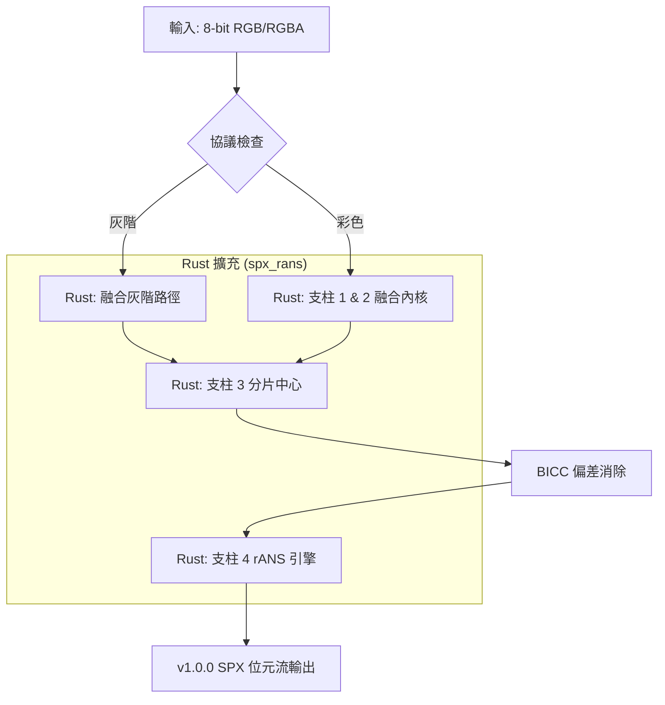

# SPX (Space Express)：高吞吐量無損影像壓縮引擎

 [](LICENSE)    

SPX (Space Express) 是一個採用 **Python/Rust 混合架構** 的無損影像壓縮引擎，具備 **熵分片 (Entropy Sharding)** 與 **Rayon 加速的 4 路交織 rANS (4-way Interleaved rANS)** 技術，旨在壓縮率與速度之間取得最佳平衡。本專案透過上下文分片與原生計算內核，實現了與現代標準相當的壓縮率，並將 Python 的靈活性與 Rust 的原生效能完美結合。

---

## 目錄
1. [v1.0.0 效能快照](#v832-效能快照)
2. [技術分析](#v832-技術分析-混合-rust-架構)
3. [與既有格式比較](#2-與既有格式比較)
4. [系統需求與安裝](#3-系統需求與安裝)
5. [快速開始](#4-快速開始)
6. [技術架構與執行流程](#5-技術架構與執行流程)
7. [效能基準測試](#6-效能基準測試-v8x-統一中心)
8. [對比基準測試](#7-對比基準測試-clic--div2k--tecnick--kodak)
9. [限制與發展路線](#8-限制與發展路線)
10. [數據集來源](#9-數據集來源)
11. [專案背景](#10-專案背景)
12. [致謝](#11-致謝)

---

SPX 的核心設計原則：
> **最大化單位算力的壓縮效率。**

不同於不計代價追求極限壓縮率的方案，SPX 專注於：
- **可預測的效能**：執行時間與輸入解析度呈線性關係 ($O(N)$)。
- **單次編碼 (Single-Pass)**：非迭代執行，無須暴力搜索。
- **極簡建模複雜度**：無狀態（Stateless）的單一模型流水線。
- **高吞吐量**：經過 ILP 優化的原生計算內核。

### 設計哲學
| 維度 | SPX 方案 |
| :--- | :--- |
| **壓縮率** | 具競爭力（與現代無損標準一致） |
| **速度** | $O(N)$ 複雜度（非迭代） |
| **複雜度** | 極小化（無狀態流水線） |
| **確定性** | 絕對確定 |
| **多重掃描** | 否 |

### 關鍵特性
*   **單次編碼**：消除迭代優化迴圈。
*   **確定性流水線**：恆定的執行路徑，無須啟發式搜索。
*   **降低模型複雜度**：單一模型的上下文映射，無須切換。
*   **吞吐量中心設計**：針對每個時鐘週期的最大像素吞吐量進行優化。
*   **原生 Rust 後端**：具備可預測運行效能的零成本抽象。
*   **可擴展架構**：分片邊界與 rANS 概率模板的模組化配置，以適應特殊的數據分佈。

---

### v1.0.0 效能快照

以下數據描述了各個標準數據集上的吞吐量與壓縮效率。

| 數據集 | 類型 | SPX BPP | **節省 (vs PNG)** | **節省 (vs PNM)** | **SPX 編碼速度** | WebP (M6) 速度 | JXL (E7) 速度 |
| :--- | :--- | :--- | :--- | :--- | :--- | :--- | :--- |
| **Kodak** | RGB | **9.79** | **-24.64 %** | **-59.19 %** | **41.24 MB/s** | 0.33 MB/s | 5.65 MB/s |
| **CLIC '25** | RGB | **8.06** | **-28.32 %** | **-66.43 %** | **69.10 MB/s** | 1.18 MB/s | 5.02 MB/s |
| **CLIC '21** | RGB | **8.46** | **-28.03 %** | **-64.74 %** | **72.22 MB/s** | 0.97 MB/s | 5.62 MB/s |
| **DIV2K Validation**| RGB | **9.22** | **-27.32 %** | **-61.59 %** | **80.76 MB/s** | 1.28 MB/s | 5.83 MB/s |
| **DIV2K Train**| RGB | **9.35** | **-26.22 %** | **-61.04 %** | **66.97 MB/s** | 1.38 MB/s | 6.15 MB/s |
| **Tecnick** | RGB | **5.18** | **-25.90 %** | **-78.42 %** | **25.12 MB/s** | 0.68 MB/s | 4.75 MB/s |
| **Tecnick** | Gray | **1.68** | **-27.63 %** | **-79.01 %** | **14.20 MB/s** | 0.29 MB/s | 5.53 MB/s |
| **ICI** | RGB | **10.51** | **n/a** | **-56.19 %** | **150.81 MB/s** | 2.16 MB/s | 10.84 MB/s |
| **ICI** | Gray | **3.44** | **n/a** | **-56.99 %** | **53.06 MB/s** | 0.58 MB/s | 12.16 MB/s |

> [!NOTE]
> **硬體基準測試環境**：
> - **CPU**: AMD Ryzen 5 3500X (6-Core, 3.60 GHz)
> - **RAM**: 32.0 GB
> - **OS**: Windows 11 (64-bit, x64)

#### **技術對比**
- **編碼速度**：在受測硬體上，SPX 的吞吐量比 WebP (Method 6) 高出 **25x–150x**，比 JPEG-XL (Effort 7) 高出 **3x–14x**。
- **完美無損**：所有 1,500+ 張測試影像均實現位元完美重建 (**MSE = 0.00000000**)。
- **核心效率**：原生 Rust 後端利用 **Rayon** 實現內部數據並行，並使用 **4 路交織 rANS** 實現指令級並行 (ILP)。
- **混合效能**：關鍵熱路徑（RCT、MED、分片、rANS）均以 Rust 實作，協調層則保留在 Python。

*完整對比分析請參閱 [Comparative Benchmarks](./technical/BENCHMARK.md)。*

---

### v1.0.0 技術分析 (混合 Rust 架構)
- **核心工作流**：統一流水線，包含 **基礎協議** $\rightarrow$ **Rust 預測內核** $\rightarrow$ **Rust 空間轉換** $\rightarrow$ **Rust 無狀態分片**。
- **預測中心 (Pillar 2)**：解耦的中心化設計，由 `predictor.py` 負責協調，`rans_core.rs` 執行 **無分支邊緣調整 MED (Branchless Edge-Tuned MED)**，大幅提升執行效率。
- **上下文感知路徑架構**：
    - **RGB 路徑 (Pillar 3/4)**：原生 Rust G-sub RCT 轉換配合無狀態分片矩陣。
    - **灰階快速路徑**：專門的單色旁路，利用序列化的綠色通道隔離。
- **無狀態分片中心 (Pillar 4)**：使用 `ShardProfile`「配置即數據」模型進行統一的上下文 ID 推導，由原生 Rust "Gather" 內核執行。
- **BICC (偏差消除)**：對殘差應用上下文驅動的 PDF 中心化，以減少離散度。
- **Bitplane rANS**：層次化熵建模，使用 **2,688 路上下文模型**（42 分片 x 64 空間模式），完全以 Rust 實作。
- **4 路交織 rANS 核心**：利用指令級並行 (ILP) 的向量化原生熵引擎。

---

## 2. 與既有格式比較

- **壓縮率**：比標準 PNG **減少約 25-30%**；在高解析度攝影圖片上與 WebP (m6) 相當。
- **效率**：無狀態分片為高頻噪點和低熵漸層提供穩定的效能表現。
- **解碼**：原生 Rust 解碼吞吐量約為 **20–130 MB/s**（取決於圖像複雜度）。可透過多核批處理擴展。

---

## 3. 系統需求與安裝

### 3.1 Windows 獨立執行檔（免安裝 Python）

對於沒有安裝 Python 的審閱者或使用者，本倉庫的 [`dist/`](./dist/) 目錄中提供了免安裝的 Windows 獨立執行檔。

**下載** `dist/spx.exe`，直接在任何終端機中執行：

```powershell
spx.exe compress photo.png
spx.exe decompress photo.spx
spx.exe --help
```

無須安裝、無須依賴套件、無須任何設定。完整使用說明請參閱 [`dist/INSTRUCTIONS.md`](./dist/INSTRUCTIONS.md)。

> [!NOTE]
> 此執行檔僅支援 **Windows 10/11 x64**。其他平台請使用下方的 pip 安裝方式。

---

### 3.2 Python 套件（全平台）

- **Python 版本**：3.10+ (建議 3.11+)
- **支援平台**：Windows x64、Linux x64/aarch64、macOS x86_64/arm64（預編譯二進位套件）

**安裝**：
```bash
pip install spx-codec
```

所有依賴套件（`numpy`、`zstandard`、`Pillow`）及 Rust 後端均自動安裝。

> [!TIP]
> **原生加速**：SPX 使用預編譯的 Rust 後端，第一次執行時**零 JIT 延遲**。
> **多執行緒**：並行處理由 Rayon 庫在 Rust 後端內部自動處理。

<details>
<summary><b>從源碼構建</b>（貢獻者 / 不支援平台）</summary>

需要 **Rust 工具鏈**（`cargo`、`rustc`）及 **maturin**：

```bash
git clone https://github.com/nonkilife/SPX-Image-Lossless-Compression.git
cd SPX-Image-Lossless-Compression
pip install maturin
maturin develop --release
```

Linux 另需：`sudo apt install build-essential zlib1g-dev libpng-dev`
</details>

---

## 4. 快速開始

### 4.1 命令列介面 (CLI)
```bash
# 壓縮
spx compress input.png --optimize

# 解壓
spx decompress input.spx --output restored.png

# 基準測試 (僅限 SPX)
spx benchmark ./path/to/images -n 20 -w 8

# 基準測試 (對比 SPX vs WebP vs JXL)
spx benchmark ./path/to/images --codec bench -n 20
```

### 4.2 Python API
```python
from spx import compress_spx, decompress_spx

# 1. 壓縮影像 (RGB/RGBA)
result = compress_spx("input.png", "output.spx", use_bitplane=False)
print(f"壓縮率: {result.ratio:.2%} | 時間: {result.enc_time:.2f}s")

# 2. 解壓影像
with open("output.spx", "rb") as f: payload = f.read()
rgb_arr, dec_time = decompress_spx(payload, "reconstructed.png")
print(f"解壓時間: {dec_time:.2f}s")
```

### 4.3 Windows 批處理工具 (`test.bat`)
為 Windows 用戶提供了方便的封裝工具：
```powershell
# 執行對比基準測試 (SPX vs WebP vs JXL)
.\test bench ./local_test_folder
.\test webp ./local_test_folder
.\test jxl ./local_test_folder

# 執行特定編碼器的測試
.\test spx ./local_test_folder

# 傳遞額外參數 (例如限制 10 張影像)
.\test spx ./my_images -n 10
```
> [!NOTE]
> 本倉庫 **不包含** `data/` 目錄與基準測試數據集。要執行基準測試，您可以手動建立 `data/` 資料夾並放入影像（如 Kodak, DIV2K），或直接引用影像資料夾的路徑。該工具支援原始絕對/相對路徑，以及在 **`core/test_suite.py`** 中管理的預設定義別名（如 `clic`, `kodak`, `trgb`）。

### 4.4 專案結構
```text
.
├── spx/                   # SPX 四柱核心引擎 (Python 協調層)
│   ├── codec.py            # 位元流調度與序列化
│   ├── common.py           # 支柱 1: 協議常量與標誌
│   ├── predictor.py        # 支柱 2: 無分支 MED 內核
│   ├── transform.py        # 支柱 3: G-sub RCT 與空間運算
│   ├── sharding.py         # 支柱 4: 分片配置與無狀態中心
│   ├── rans.py             # 支柱 4: 4 路交織 rANS 核心
│   └── env.py              # 環境與依賴驗證
├── technical/              # 實驗流程及結果文檔
├── data/                   # [用戶提供] 基準測試數據集目錄 (不包含在倉庫中)
├── native/                 # [實驗性] Rust 加速後端
├── test.bat                # Windows 基準測試工具
└── main.py                 # CLI 入口點
```

---

## 5. 技術架構與執行流程

SPX 遵循嚴格定義的 **四柱架構 (4-Pillar Architecture)**：

### 5.1 SPX 的四大支柱
1. **支柱 1: 空間轉換 (RCT)**：透過綠色減法 RCT (`transform.py`) 處理色彩去相關。
2. **支柱 2: 空間預測 (MED)**：透過無分支邊緣調整 MED (`predictor.py`) 執行空間去相關。
3. **支柱 3: 無狀態分片**：將殘差映射到統計上下文（分片）以進行優先編碼 (`sharding.py`)。
4. **支柱 4: 熵編碼 (rANS)**：透過 4 路交織 rANS 引擎 (`rans.py`) 執行統計壓縮。

這些支柱由 **基礎協議** (`common.py`) 統一管理，該協議定義了位元流架構與編碼閾值。



#### 支柱 1 — 綠色減法 RCT（色彩去相關）

RCT 的目標是對三個色彩通道進行去相關，使每個通道的殘差具有更低的熵。

早期設計將影像分解為**灰階通道**（亮度）、**次要色彩通道**與**純色通道**——例如 `(10, 30, 50)` RGB → `10`、`20`、`20`。此方法將結構資訊保留在灰階通道中，使色彩通道的 MED 預測命中率翻倍。然而，每個像素需要額外 3 個位元來記錄兩個色彩通道的零值位置。

SPX v1.0.0 改用標準的**綠色減法 (G-sub)** 轉換，在不需要零值位置開銷的情況下達到相同的壓縮效果：

| 通道 | 公式 | 範例 `(R=10, G=30, B=50)` |
| :--- | :--- | :--- |
| **G** | 綠色通道原始值 | `30` |
| **RD** | R − G（uint8 循環溢出） | `236`（= −20 mod 256） |
| **BD** | B − G（uint8 循環溢出） | `20` |

#### 支柱 2 — 邊緣調整 MED（空間預測）

SPX 在多個數據集上評估了 GAP、Paeth 和 MED 三種預測器。Plain MED 始終產生最佳壓縮率。隨後，MED 被擴充了**邊緣調整 (Edge Tuning)** 因子：當相鄰像素值差異超過 50 時，預測器鎖定更接近的鄰像素，而非計算中位數。此機制可防止在銳利邊緣與不連續處產生大幅殘差過衝。

詳細的統計分析與邊緣案例評估請參閱 [PREDICTOR.md](./technical/1.%20PREDICTOR.md)。

#### 支柱 3 — Universal-42 無狀態分片

預測後，殘差依據三個像素級特徵被分類至恰好 **42 個分片**，按實驗重要性排序：

| 特徵 | 符號 | 描述 |
| :--- | :--- | :--- |
| 梯度強度 | **V** | 局部邊緣的銳利程度？ |
| 亮度 | **I** | 此處為暗部、中間調還是亮部？ |
| 趨勢 | **T** | 局部色彩亮度是上升、下降還是平坦？ |

42 個分片的分區方式如下：

- **V = 0（平坦區域）**：無明顯趨勢，僅依亮度分 3 個分片。ID 0–2。
- **1 ≤ V ≤ 3（柔和邊緣）**：三個特徵均顯著——3 個 V 層 × 3 個 I 層 × 3 個 T 值 = **27 個分片**。ID 3–29。
- **V ≥ 4（銳利邊緣）**：在強邊緣處，亮度的重要性降低，僅使用 V 和 T——4 個 V 層 × 3 個 T 值 = **12 個分片**。ID 30–41。

此分區（42 個，而非 60 或 80 個）基於實驗證據選定；更高的分片數有過擬合訓練數據集的風險。

分片完成後，**BICC（偏差消除）** 將各分片的殘差向零點偏移（若殘差已偏離中位數）。BICC 單獨對壓縮率的提升微乎其微，但可確保殘差分佈與第四支柱的 rANS 經驗模板緊密對齊。

詳細的邊界推導請參閱 [SHARD_TEMPLATE.md](./technical/2.%20SHARD_TEMPLATE.md)。

#### 支柱 4 — 兩遍掃描 rANS 熵編碼

殘差在熵編碼前先進行 **ZigZag 映射**（有符號 → 無符號），使正負小值均映射至小符號，保持概率分佈緊湊。

rANS 階段在編碼前執行兩遍掃描：

- **第一遍——統計分析**：掃描所有分片以收集直方圖、符號計數與分片寬度。若某分片的符號範圍僅在 0–23 內，則符號 24–255 將被完全排除，縮小 PDF 標頭。
- **第二遍——實體分片**：將數據整理至連續記憶體區塊，消除平行編碼階段的隨機存取模式，最大化 CPU 指令級並行 (ILP)。

**模式選擇（共 34 種模式）：**

| 模式 | 名稱 | 描述 |
| :--- | :--- | :--- |
| **0** | 自定義 PDF | 編碼器為該分片建立唯一概率表。攜帶約 120 位元（15 位元組）的標頭代價；僅在壓縮增益超過此代價時選用。 |
| **1–2** | 保留 | 為未來架構擴展預留的槽位。 |
| **3** | 零熵 | 用於僅含單一符號的分片（通常為全零）。該分片不寫入任何位元流載荷。 |
| **4–33** | 經驗模板 | 基於真實影像分片 K-means 分析得出的 10 個統計質心，各以 ×0.5、×1.0、×1.5 縮放——共 30 個模板。儲存於 `rans_mode.npz` 並硬編碼於解碼器（每分片僅需 1 位元組模式標頭，無需傳輸 PDF）。 |

編碼器選擇理論位元代價（交叉熵）最低的模式，模式 0 附加 120 位元懲罰。模板形狀源自自然影像數據集，在分佈外內容上可能存在過擬合。

編碼透過 **Rayon**（每分片一個執行緒）平行化，並在每個分片內使用 **4 路交織 rANS** 以發揮 ILP 吞吐量。

#### Bitplane rANS — 高結構性替代編碼路徑

灰階影像**一律**使用 Bitplane rANS。RGB 影像則在第一遍統計數據同時滿足以下三個條件時自動啟用：

| 指標 | 閾值 | 原因 |
| :--- | :--- | :--- |
| Shannon 熵 (H) | < 3.2 位元/符號 | 標準上下文分片在此閾值以上效果趨於飽和 |
| 零殘差命中率 | > 30% | Bitplane 稀疏模型僅在大量殘差為零時有效 |
| P90 符號寬度 | < 112 | 寬殘差分佈使 2-bit 圖層推導代價過高 |

Bitplane rANS 不以 256 符號字母表對殘差編碼，而是將每個 8-bit ZigZag 殘差分解為 **4 個 2-bit 圖層**：

| 圖層 | 位元 | 字母表 |
| :--- | :--- | :--- |
| 圖層 0 | bits 0–1（LSB 對） | 4 個符號（0–3） |
| 圖層 1 | bits 2–3 | 4 個符號（0–3） |
| 圖層 2 | bits 4–5 | 4 個符號（0–3） |
| 圖層 3 | bits 6–7（MSB 對） | 4 個符號（0–3） |

每個圖層使用 **2,688 路上下文模型**（42 個分片 × 64 個空間模式）進行編碼。64 個空間模式來自與標準 rANS 相同的空間 LUT 特徵位元組——V 層（3 位元）× 趨勢（2 位元）× 噪聲旗標（1 位元）= 64 種組合。這在保持每圖層字母表小巧的同時，提供了比 34 模式路徑更細緻的逐像素上下文粒度。

**RGB Bitplane——綠色優先策略：**

當 RGB 影像觸發 Bitplane rANS 時，三個通道並非對等處理：

1. **綠色 (G)** 通道首先編碼，使用自身左/上鄰像素的自參考空間上下文。
2. 重建後的綠色通道隨即作為 RD 和 BD 色差通道的**空間錨點**。由於色差殘差與局部綠色結構高度相關，此錨點使 rANS 引擎能以更高精度建模 RD/BD 殘差。
3. 三個通道透過 `ThreadPoolExecutor` **並行編碼**，在原生 Rust FFI 呼叫期間釋放 Python GIL。

每個圖層的 PDF 表以 Zstd（等級 3）壓縮後寫入位元流標頭，4 路交織 rANS 狀態（4 × uint64）緊接於各通道的編碼位元流載荷之前儲存。

### 5.2 深度技術系列
詳細演算法規格請參閱 `technical/` 目錄下的文檔：
*   [**01. PREDICTOR.md**](./technical/1.%20PREDICTOR.md)：空間調度器與 MED 變體的詳細邏輯。
*   [**02. SHARD_TEMPLATE.md**](./technical/2.%20SHARD_TEMPLATE.md)：Universal-42 矩陣與上下文推導規格。
*   [**03. RANS_MODE.md**](./technical/3.%20RANS_MODE.md)：4 路交織 rANS 核心架構與概率建模。
*   [**04. DATASET_FINGERPRINT.md**](./technical/4.%20DATASET_FINGERPRINT.md)：工業數據集的統計效能剖析。

### 5.3 雙路徑策略
SPX 實作了 **上下文感知旁路 (Context-Aware Bypass)** 邏輯，以處理不同類型的影像：
* **RGB 路徑**：利用 **G-sub RCT**，先提取綠色基礎（Lead），隨後處理紅/藍殘差（Lag）。使用交錯處理窗口以保持通道間的上下文一致性。
* **灰階路徑**：若檢測到 R=G=B，引擎會使用專門的單色分支，將計算開銷降低約 65%。此路徑利用 **Bitplane rANS** 將 8-bit 信號分解為 4 個 2-bit 圖層，以提高冗餘提取效率。

### 5.4 分片與配置驅動中心
SPX 的骨幹是 **無狀態分片中心**，根據 V-Tier（梯度強度）、亮度（Intensity）和趨勢（Trend）將像素映射至恰好 **42 個上下文**。這種「配置即數據」的模型允許在不重新編譯內核的情況下無縫切換 Profile。

在熵編碼方面，引擎使用 **34 種模式選擇系統**——完整的模式表請參閱第 5.1 節支柱 4 的說明。其中 30 個經驗模板模式（4–33）硬編碼於解碼器中，每個分片僅需 1 位元組的模式標頭。

### 5.5 Bitplane rANS 與熵核心
Bitplane rANS 是標準 rANS 路徑的替代編碼路徑。它將每個 8-bit 殘差分解為 4 個 2-bit 圖層，每層使用 **2,688 路上下文模型**（$42 \text{ 分片} \times 64 \text{ 空間模式}$），使 rANS 核心能夠將結構性可預測位元與隨機噪點位元隔離。觸發條件與完整說明請參閱第 5.1 節的 Bitplane rANS 段落。

**交織 rANS** 引擎透過在單個迴圈中管理 4 個獨立狀態變量，利用 ILP 提升 CPU 執行單元的利用率。

### 5.6 記憶體占用與擴展性
SPX 旨在實現低延遲處理，並具備可預測的記憶體占用：
- **峰值 RAM (1080p RGB)**: ~85 MB
- **峰值 RAM (4K RGB)**: ~320 MB
- **峰值 RAM (8K RGB)**: ~1.2 GB
*註：記憶體使用量與像素數呈線性關係。*

---

## 6. 效能基準測試
  
當前引擎使用 **SPX Bencharmk Hub** 進行測試，提供與 WebP (Method 6) 和 JPEG-XL (Effort 7) 的對比分析。

### 6.1 綜合指標
詳細的效能數據（包括壓縮節省率、吞吐量 MB/s 和競爭勝率）維護在 [technical/BENCHMARK.md](./technical/BENCHMARK.md)。

### 6.2 基準版本
為確保可重複性，競爭基準鎖定在以下版本：
- **WebP (Method 6)**: `cwebp` v1.3.2 (libwebp v1.3.2)。
- **JPEG-XL (Effort 7)**: `cjxl` v0.8.2 (libjxl v0.8.2)。

### 6.3 使用方法
```bash
# 使用主入口點
python main.py benchmark C:\datasets\my_images -n 50

# Windows 快捷方式 (Batch)
.\test bench ./local_folder -n 50
```

---

## 7. 對比基準測試 (CLIC / DIV2K / TECNICK / ICI / KODAK)

詳細的效能指標以及與 WebP、JPEG-XL 在工業數據集上的對比基準測試，請參閱獨立的基準測試文檔：

👉 **[查看對比基準測試 (BENCHMARK.md)](./technical/BENCHMARK.md)**

---

## 8. 限制與發展路線

- **位元深度**：目前限制為每通道 **8-bit**。
- **色彩空間**：針對 **RGB** 優化。不支援 CMYK 或 YCbCr 子採樣。
- **Alpha 通道**：雖然支援 RGBA，但 Alpha 通道目前使用傳統的 Zstd 壓縮（Level 1），未來計畫引入高效 rANS 優化。
- **執行緒**：Python 協調層為單執行緒；但 Rust 後端在熱路徑內核中使用 **Rayon** 實現數據並行。
- **效能上限**：目前的吞吐量是透過無分支算法設計與 LLVM 自動向量化實現的。**目前沒有手寫的 SIMD (AVX2/NEON) 實作**。
- **內容偏向 (Content Bias)**：目前的基準測試主要針對 **「自然攝影影像」**。由於缺乏專門的測試數據集，SPX 在 **「人工合成內容」**（如螢幕截圖、UI 介面或電腦繪圖）上的效能尚未經過大規模驗證。處理具有高頻邊緣的人工圖案時，表現可能與照片有所不同。本專案作為高效能基準，若尋求極限優化，可考慮進一步的手動彙編優化。

---

## 9. 數據集來源

要驗證基準測試或使用標準數據集測試引擎，您可以從以下官方來源下載影像：

- **DIV2K Data Set**: [ETH Zurich CVL](https://data.vision.ee.ethz.ch/cvl/DIV2K/)
- **Kodak Data Set**: [Kaggle - Kodak Dataset](https://www.kaggle.com/datasets/sherylmehta/kodak-dataset/data)
- **Clic Data Set**: [Kaggle - CLIC Dataset](https://www.kaggle.com/datasets/mustafaalkhafaji95/clic-dataset?resource=download)
- **Tecnick Data Set**: [SourceForge - TestImages](https://sourceforge.net/projects/testimages/files/SAMPLING/)
- **Standard Test Images (ICI)**: [Image Compression Info](https://imagecompression.info/test_images/)

---

## 10. 專案背景

SPX 專案是一個透過多階段研究週期開發的無損影像壓縮框架。本專案利用代理 AI **Claude Code** 與 **Antigravity** 來構建技術組件，包括 **四柱架構**、Universal-42 分片以及 4 路交織 rANS 熵編碼引擎。在 v1.0.0 中，核心計算內核從 Python/Numba 遷移到了 **原生 Rust 後端**，實現了顯著更高的吞吐量並減少了運行時 JIT 開銷。

此專案作為 **AI 輔助工程 (AI-assisted engineering)** 的技術概念驗證，證明了自主代理能夠協助處理複雜的演算法優化與多語言系統整合。

## 11. 致謝
- **熵編碼**：本專案使用了由 Jarosław (Jarek) Duda 博士開發的 rANS 演算法。
- **空間預測**：空間去相關引擎使用了最初在 LOCO-I (JPEG-LS) 標準中引入的邊緣檢測器 (MED) 演算法。

---

**當前版本:** v1.0.0 | **授權:** Apache 2.0 | **MSE 目標:** 0.00000000
